# CHATBOT IA - LII STORE

---

### Integrantes

| Nombre                           | Carnet        |
|:---------------------------------|---------------|
| Roberto Carlos Pernillo Donis    | 7690-18-9965  |
| Niels Manfredo Hernandez Flores  | 7690-18-1574  |
| Jose Juan Carlos Ramirez Cortave | 7690-14-10616 |

### Tecnologías utilizadas
| Tecnología | Categoría         |
|:-----------|-------------------|
| Dialogflow | Chat AI           |
| Node       | Backend           |
| Javascript | Backend language  |
| Express    | Backend framework |
| Sequelize  | ORM               |
| MySQL      | Database          |
| Telegram   | Communication     |

---

## Flujo del chatbot

El Chatbot se realizó utilizando el siguiente flujo de trabajo:
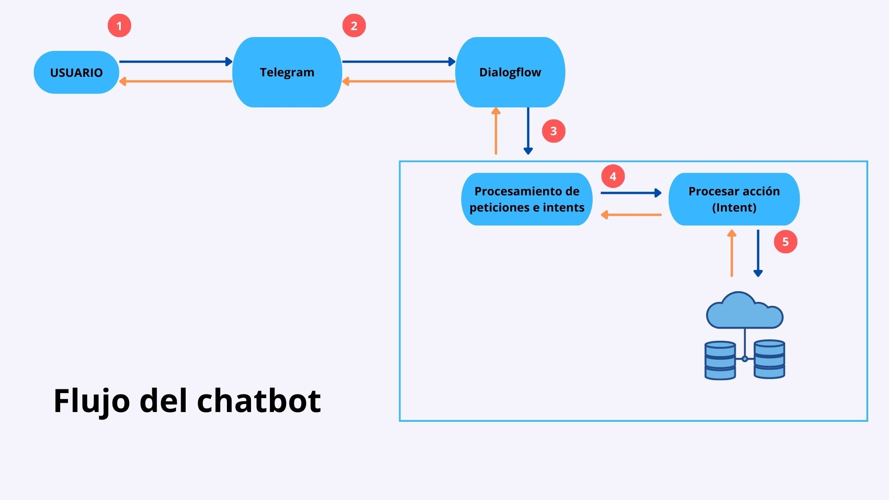

1. El usuario se conecta a Telegram y le envia un mensaje al chatbot.
2. El bot de Telegram procesa el mensaje y lo recibe la aplicación de Dialogflow
3. Dialogflow tiene dos opciones:
   1. Responder al mensaje con alguno de los intents definidos
   2. Enviar la información del intent hacia el backend implementado en NodeJS
4. El backend procesa la información envíada por parte de Dialogflow
5. Luego de procesar la información, identifica el intent y ejecuta una lógica para dicho intent, la cuál puede ser:
   1. Solicitud a la base de datos
   2. Envio de información
   3. Consulta de una API externa

## Implemetación

---
La implementación del chatbot se llevó a cabo utilizando distintas tecnologías.

### Creación del bot en Telegram
El primer paso fue la creación y configuración del chatbot el telegram utilizando BotFather, 
el cuál es el inicial del cual se crean todos los bots en telegram.

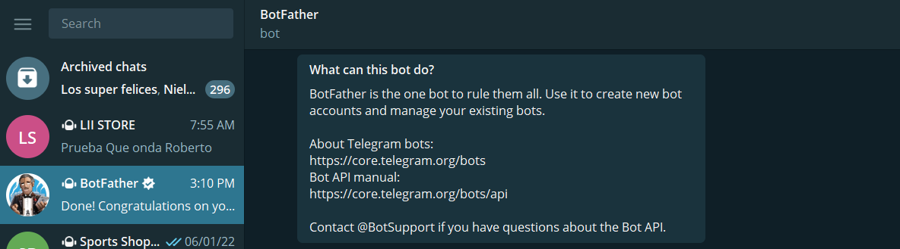

El comando inicial para iniciar a ejecutar es `/start`, este muestra los comandos disponibles para
trabajar.

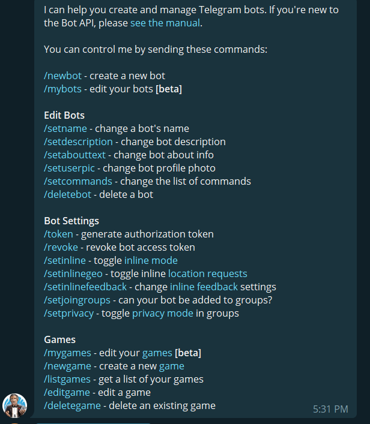

Luego se procede a ejecutar el commando `/newbot` el solicita un conjunto de valores para configurar nuestro bot.
El nombre del bot y el username son los valores que se requieren.

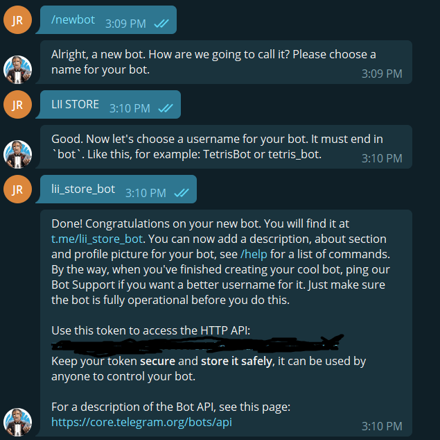

Con esto finaliza la configuración que realizamos en Telegram para configura el bot.

### Configuración de Dialogflow

Dialogflow es la plataforma de Google que nos permite implementar machine learning dentro del chatbot, para ello 
fue necesario crear un agente dentro de la plataforma.

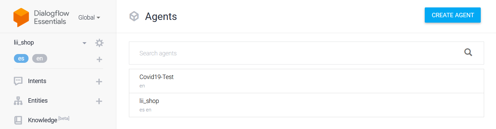
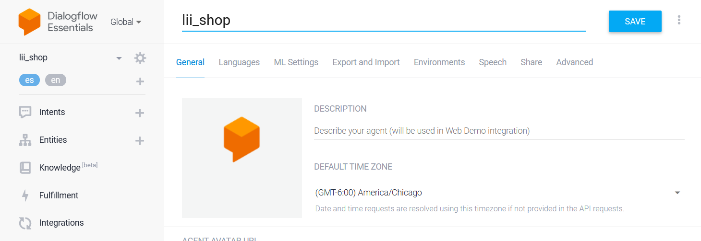

#### Intents
Dialogflow utiliza los Intents como medio de comunicación y procesamiento de información. Dentro de estos se configuran
los distintos valores que se pueden obtener como entrada por parte del usuario y de igual forma se configuran las distintas
respuestas que se pueden mostrar al usuario.
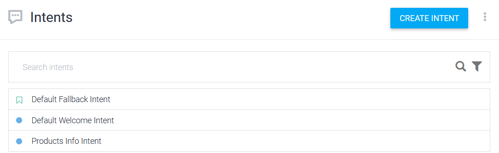

Los intents se pueden configurar en distintas formas, nosotros utilizamos dos formas:
* Configuración básica
* Configuración mediante fulfillment

#### *Intents con configuración básica*
Estos intents reciben un conjunto de valores que puede el usuario ingresar y responden con las respuestas
indicadas.

El primer paso para configurar este tipo de intents es la configuración de training phrases, las cuales son las frases que el
usuario podría ingresar.

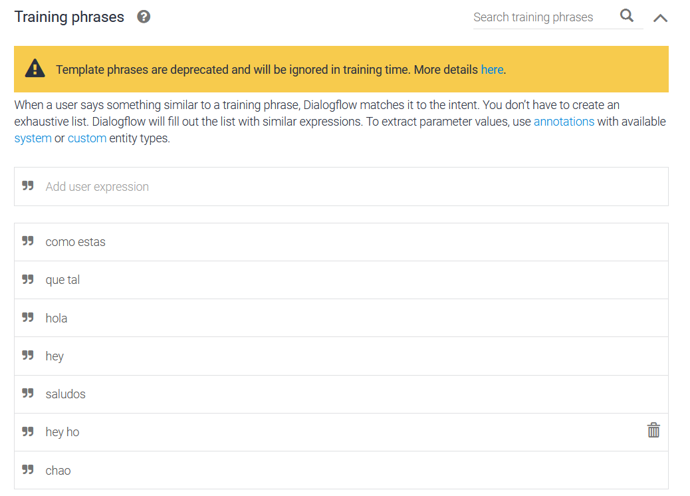

Posteriormente se configuran, las respuestas, estas pueden ser de diferentes tipos, texto, tarjetas, etc.


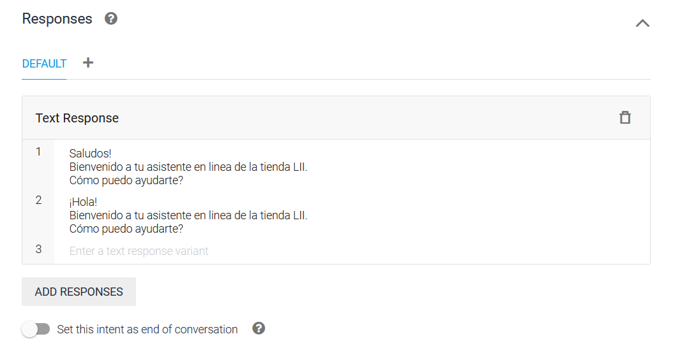

#### *Intents con configuración mediante fulfillment*
El objetivo de estos intents es comunicarse con un backend proporcionado el cual se encargue de procesar la información de los
intents habilitados con está opción y en el cual se tenga un mayor control de la información que se quiera envíar al usuario
ya que se puede enviar la información directamente de la base de datos del usuario que configura el agente.

Para comunicarse con el backend personalizado del usuario se debe habilitar la opción en cada intent que se desea
controlar desde el backend

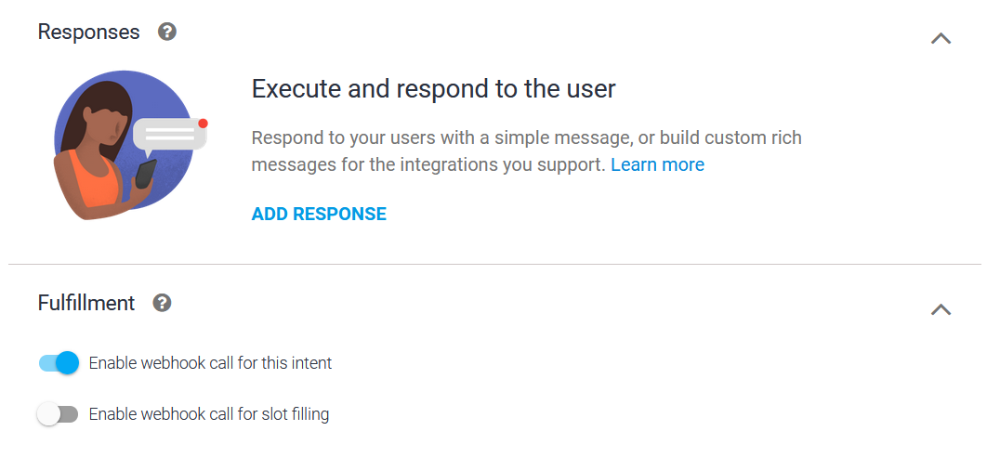

El siguiente paso es configurar la URL que se encarga de procesar cada uno de los intents, esto se realiza
desde la opción Fulfillment

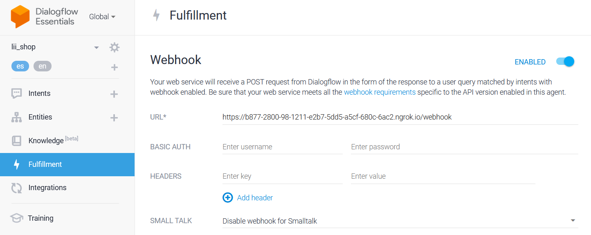

Una vez realizado este proceso, cada uno de los intents que tengan habilitada la opción `Enable webhook call for this intent`
se enviarán al backend donde serán procesados según la configuración requerida.

#### Integraciones
Dialogflow permite la integración con diferentes canales de comunicación, en nuestro caso, Telegram fue el canal utilizado.
Para realizar esta integración es necesario ingresar a la opción `Integrations`, desde el cual se muestran
diferentes plataformas con las que se puede integrar.

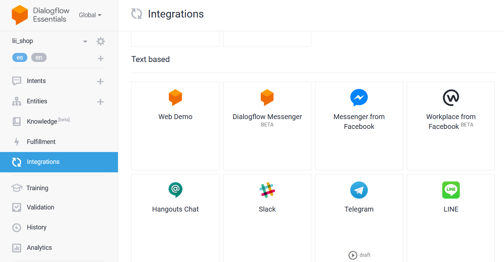

En nuestro caso seleccionamos Telegram, dentro se nos solicitara el api key generado por BotFather y el cual utilizará
Dialogflow para integrase con Telegram.
Una vez configurado esto se pueden probar el funcionamiento del bot dentro del Telegram.

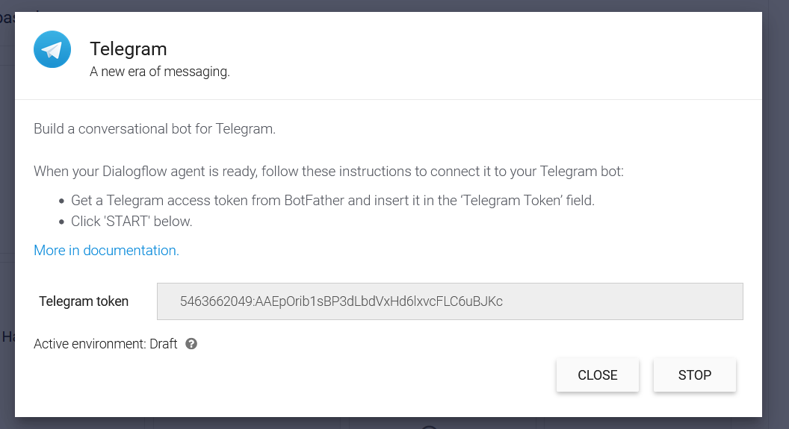

### Creación de Backend
El backend fue realizando primero utilizando Java, pero como no se logró enviar cards a través de telegram se hizo pruebas con Python y Flash,
finalmente se decidio realizar con Node y Express.

El backend debe configurarse para poder aceptar solicitudes de Dialogflow para eso se utilizan las siguientes librerias:

| Librerías              | 
|:-----------------------|
| actions-on-google      |
| dialogflow-fulfillment |

El objetivo es exponer una API a la cual se pueda comunicar dialogflow.

Esto se realizo a traves del siguiente codigo, donde se indentifica el intent que queremos procesar y se envia una funcion que responderá
cuando dicho intent sea invocado.
```
intentMap.set('Products Info Intent',handleWebHookIntent)
```

## Funciomiento

---

Una vez configurados todos los pasos necesario para la creación del bot, se procede a realizar la prueba.

Para ello primero se busca el bot creado dentro de telegram, en nuestro caso esta es la información de nuestro bot.

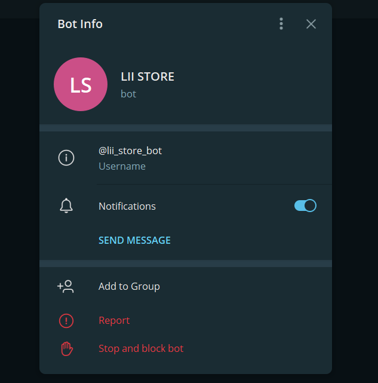


Posteriormente, empezamos la interacción
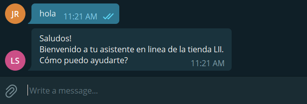

Al momento de realizar el ingreso de una frase que tiene integración con el backend, el backend se encarga de responder la información de los productos y la podemos observar.
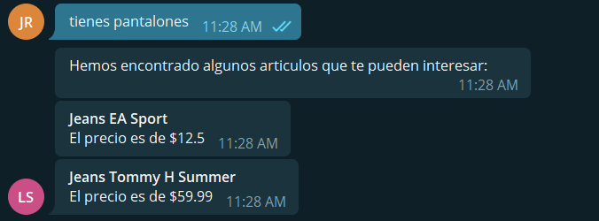
